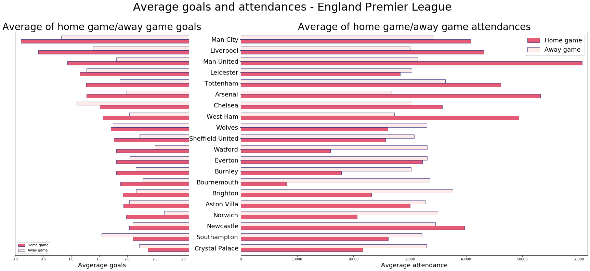
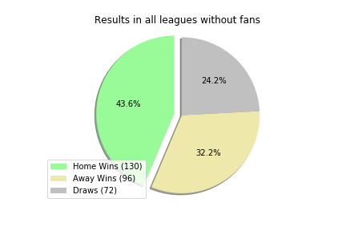

# Soccer Home Advantage

## Soccer - Is home team advantage real? 

### The charts

#### Weather impact on average goals

* Average number of goals in temerature range (F) - bar plots

#### Audience impact on game

* Average score and average attendance of each team - horizontal bar plots

* Goals of home/away and attendances - [scatter plots](images/Audience_impact/ALL_scatter_scores_att.png)

* Number of wins of home/away about attendances - [bar plots](images/Audience_impact/ALL_bar_scores_att_bins.png)

#### Game before/after COVID

* Game results before COVID vs. after COVID - pie plots
 

* Goals per match before COVID vs. after COVID - [bar plots-before COVID](images/Covid_impact/ALL3.png), [bar plots-after COVID](images/Covid_impact/ALL4.png) 

### Data Analysis Observations:

* In extreme weather home team is more likely to score higher

* In extreme heath home team is more likely to win

    - Not true for Germany, as temp increases away team is going to score higher
    
* Overall home team performs better during home game regardless of audience count

    - Lower capacity stadium games where home and away team performs equally
        
    - Higher capacity stadium, home games performance is much higher
    
* Three of the four leagues where home team is performing better without home fans

    - England home teams performs better in empty stadiums

    - Spain is the only league where home teams perform better with home fans

### Data Limitation:

* Weather limitation, average temp for the game day

* Not all game attendance data were available which impacted the data pool size

* Not much data available for the games after the COVID

    - Number of Games played after COVID are very limited

* Perfect data set would have been full season schedule for normal
